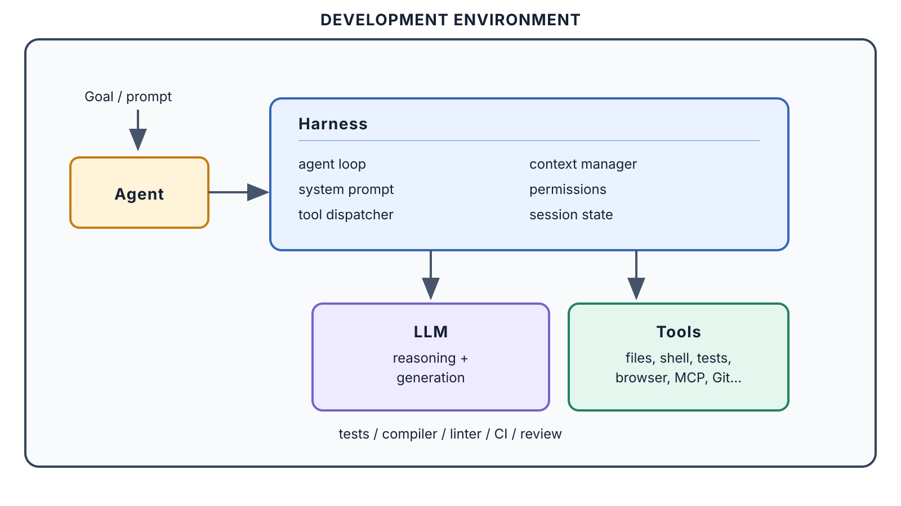
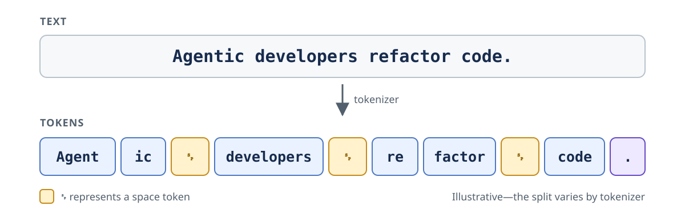
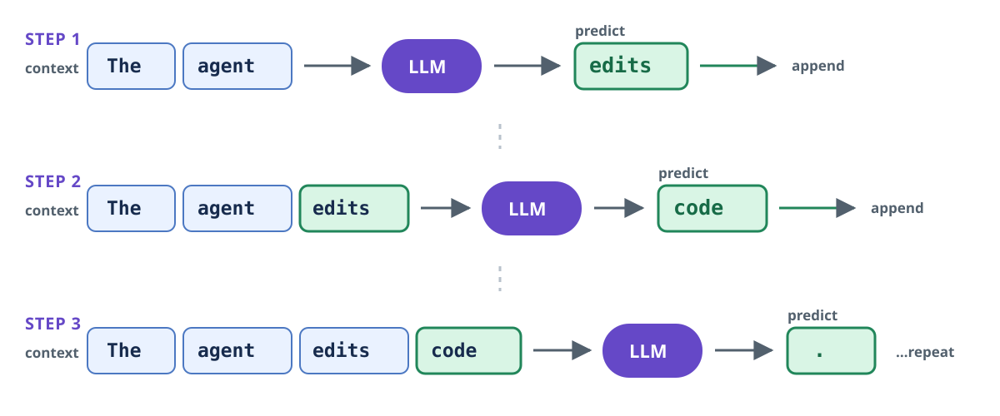
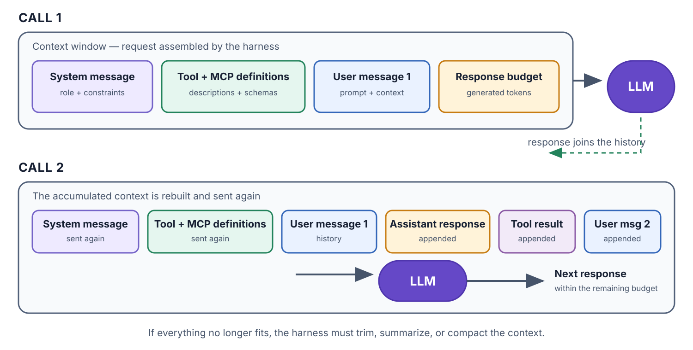

## Vibe coding 

::: {.fragment}
> There's a new kind of coding I call "vibe coding", where you fully give in to the vibes, embrace exponentials, and forget that the code even exists. 
> 
> -- Andrej Karpathy, February 2025
:::

## Levels of AI-assisted development

| Level | Developer | AI  |
|---|---|---|
| Autocomplete | Current code | Predicting the next code |
| Conversational assistance | A question + selected context | Explaining or proposing an edit |
| Agentic coding | A goal | Planning, searching, editing, running |
| Agentic engineering | A goal + engineered environment | Executing within instructions, workflows, tools, validation |

## Development environment
{fig-alt="Agent harness in a development environment" width="95%"}

# LLM fundamentals

## Tokens
LLMs do not process text as whole sentences. A **tokenizer** splits it into tokens: words, parts of words, punctuation, or whitespace.

{fig-alt="The sentence Agentic developers refactor code split into tokens, including word fragments, spaces, and punctuation" width="100%" fig-align="center"}

::: {.callout-note appearance="simple"}
As a rough rule of thumb for English: **1 token ≈ ¾ of a word**. The exact split depends on the tokenizer.
:::

## Autoregressive generation
An LLM generates one token at a time. Each chosen token is appended to the context before the model predicts again.

{fig-alt="Three steps of autoregressive generation, with each predicted token appended before the next prediction" width="100%" fig-align="center"}

It is repeatedly answering: **“What token should come next?”**

## Inline suggestions
Copilot began as next-token prediction in your editor. It is essentially generative autocomplete.  

- LLM predicts the continuation
- Copilot displays it as an inline suggestion  
- **Press `Tab` to accept**

::: {.fragment}
*Demo: inline suggestions in VS Code*
:::

## Context window

The **context window** is the model's working memory for a single call: the
maximum number of tokens it can consider when generating the next response.

It contains more than your latest prompt:

- the **system message**: role, behaviour, and constraints;
- **tool and MCP definitions**: names, descriptions, and input schemas;
- conversation messages, selected code, and tool results;
- space for the model's generated response.

::: {.callout-note appearance="simple"}
The context window is finite. As it fills, older or less relevant content may
need to be removed, summarized, or compacted.
:::

## Context engineering

{fig-alt="Two successive model calls. The second call resends the system message and tool and MCP definitions, then appends the previous assistant response, a tool result, and the next user message to the conversation context." width="100%" fig-align="center"}

The harness rebuilds and sends the accumulated context on every call. New user,
assistant, and tool-result messages are appended for the next call—the model
does not remember them unless they are sent again.

::: {.fragment}
*Demo: Session Info and Developer: Open Chat Debug View*
:::

## Attention

**Attention** helps the model decide which parts of the context matter.

- As the context fills, useful information competes with noise.
- Recall is often weakest in the middle.

::: {.callout-important appearance="simple"}
## Lost in the middle

Being inside the context window does not guarantee being remembered.
:::

# Models

## Frontier AI labs

| | Small / efficient | Medium / balanced | Large / capable |
|:---:|:---:|:---:|:---:|
| {fig-alt="Anthropic" width="42"} | **Claude Haiku 4.5** | **Claude Sonnet 5** | **Claude Opus 5** |
| {fig-alt="OpenAI" width="42"} | **GPT-5.6 Luna** | **GPT-5.6 Terra** | **GPT-5.6 Sol** |
| {fig-alt="Google" width="42"} | **Gemini 3.5 Flash-Lite** | **Gemini 3.7 Flash** | **Gemini 3.1 Pro**[^gemini-preview] |

::: {.fragment}
*Poll: which model do you use?*
:::

[^gemini-preview]: Preview model.

## Alternatives
open source chinese, auto, a pool on model chocies

# Effective usage
Cost
Prompt caching
Effort
Intelligence index
